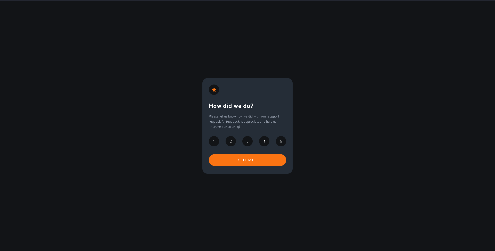

# Frontend Mentor - Interactive rating component solution

This is a solution to the [Interactive rating component challenge on Frontend Mentor](https://www.frontendmentor.io/challenges/interactive-rating-component-koxpeBUmI).

## Table of contents

- [Overview](#overview)
  - [Screenshot](#screenshot)
  - [Links](#links)
- [My process](#my-process)
  - [Built with](#built-with)
- [Author](#author)

## Overview

### The challenge

Users should be able to:

- View the optimal layout for the app depending on their device's screen size
- See hover states for all interactive elements on the page
- Select and submit a number rating
- See the "Thank you" card state after submitting a rating

### Screenshot

### Links

- Solution URL: [https://github.com/mat1asortiz/interactive-rating-component-main](https://github.com/mat1asortiz/interactive-rating-component-main)
- Live Site URL: [https://mat1asortiz.github.io/interactive-rating-component-main](https://mat1asortiz.github.io/interactive-rating-component-main)

## My process

### Built with

- Semantic HTML5 markup
- CSS custom properties
- Flexbox
- Mobile-first workflow
- JavaScript

## Author

- Website - [Matias Ortiz](https://portafolio-matias-ortiz.000webhostapp.com/)
- Frontend Mentor - [@mat1asortiz](https://www.frontendmentor.io/profile/mat1asortiz)
